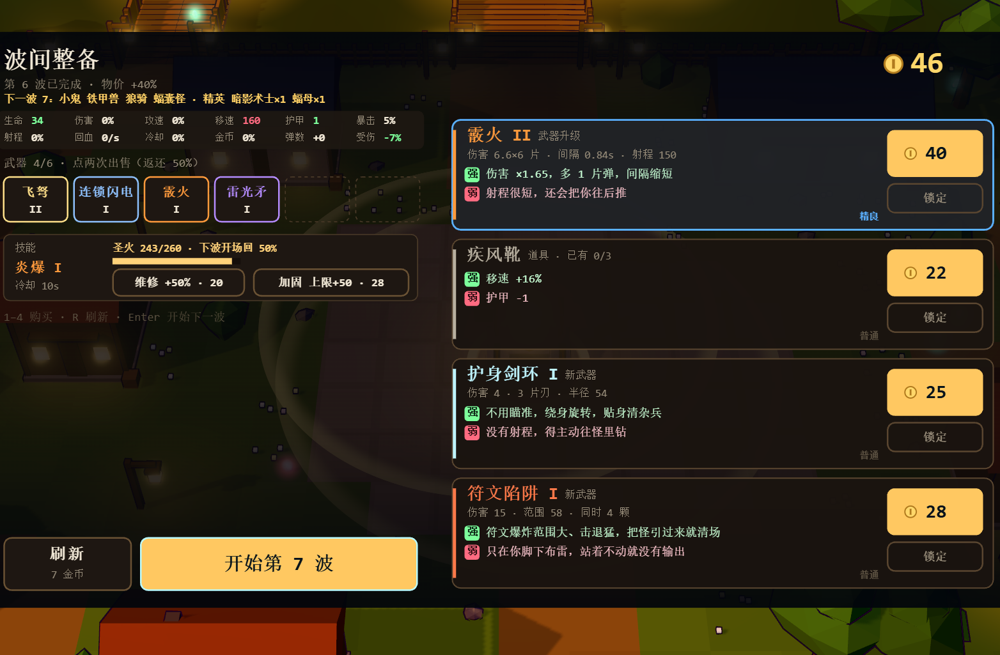

# 局内整备界面图像化评审与 Claude 交接单

日期：2026-09-24  
项目：环带值守（Ringwatch）Steam 横屏版  
负责人确认：待实现需求，不代表本稿是最终 UI 定稿。

## 用户原始要求

> “ui交互应该有图片的 不能纯文字”
>
> “你要把我对你的要求全都放在日志里 最后claude也要能看到进行全面优化”

以下是对这两条要求的可执行解释和验收标准。本文件与截图已放入仓库，供 Claude 工程实现和复核。

## 当前截图与问题

截图展示的是一局战斗后的波间整备页。右侧武器、技能、建筑科技、道具选项主要依靠文字名称、属性说明和价格区分，缺少能让玩家一眼认出的物件图像；左侧的武器槽、技能、圣火维修/加固及底部操作也缺少一致的图像提示。玩家需要先逐行阅读，才能知道每张卡代表什么。

## 设计目标

将整备页从“读文字选数值”改成“先认出物件，再用文字比较效果”。图像用于识别武器、技能、科技、道具和操作；名称、数值、强弱项仍保留为文字，图像不能替代必要信息。

## 必须实现

1. **每张可购买选项卡都要有物件图像。** 覆盖武器、主动技能、建筑科技和全部道具。图像应按稳定 ID 映射；不能只给稀有物品加图，也不能依赖名称首字、纯色方块、emoji 或字母充当图片。
2. **主要操作有简明图标。** 为维修圣火、加固、刷新、免费刷新、开始下一波提供语义明确的小图标；保留简体中文按钮文案与当前键盘/鼠标操作。
3. **选项状态清楚。** 选中、已购买、锁定、金币不足、刷新后的新选项都要有明显且一致的图像/边框/明暗状态；灰化不可购买卡时，物件仍应看得见。
4. **图片和信息并排。** 先看物件图，再看名称/品阶、关键属性、强项与代价、价格；不要缩小文字来硬塞图，也不要让说明文字互相挤压。
5. **视觉延续现有世界。** 使用原创奇幻守村风格，轮廓清楚、低多边形/平面着色或与现有 3D 模型一致；色彩沿用当前黑棕底、暖金奖励色、青蓝交互色及品阶色。图像要有体积和物件特征，不能退化成纯文字标签或抽象色点。
6. **资源边界。** 负责人已明确批准为本次整备页使用原创或已授权图像；截图仅供设计参考，不得直接当作游戏 UI 背景。不得引入第三方游戏素材、商标或未经授权图片，不加载网络图片。截图文件留在 `docs/art-ref/`，不得被打入运行包。

## 设计建议（实现时可按现有代码结构取舍）

- 先给每类物件建立稳定的 ID 到图像映射；34 件道具需要逐件有辨识度，确实无法逐件制作时，至少按物件形状/效果做明确分组插画，并保留可扩展映射。
- 复用现有卡片的品阶颜色与强/弱信息；推荐把每张卡左侧留作图像区，右侧排名称、两行以内的核心属性与价格/锁定按钮。
- 对维修、加固、刷新、开始波次，用同一图标语言的小型图标即可；不要给所有辅助文案机械加装饰图案。
- 原创矢量插画、Canvas 绘制的物件小插画或原创位图图集都可评估；最终画面必须能被玩家认作“物件图”，不只是文字旁的通用符号。优先离线可用、易打包、易维护的资源方案。

## Claude 实施与验收

Claude 请先读取本文件与 `docs/ART.md`，再在现有整备流程中完成图像化优化，不改战斗规则、武器平衡和购买逻辑。

- 在 **1280×720 横屏**和实际 16:9 窗口检查卡片、按钮、图像比例、文字可读性与裁切；再检查一种非 16:9 窗口尺寸，确认布局不会遮挡操作。
- 实际测试选购、锁定/解锁、余额不足、刷新、维修/加固、开始下一波；鼠标和键盘已有路径均须保持有效。
- 运行 `npm run check`、`npm run test:flow`、`npm run shots`；如实现方式新增资源，再核对桌面打包包含正确文件且不包含这张参考截图。
- 提供整备页改动前后截图。若截图或测试暴露卡片文字拥挤、图片失真、状态难以辨认，继续修到通过后，再把本条从「待工程实现」移至「已实现」并附证据。

## 当前范围

本交接单仅记录负责人要求并授权的下一项 UI 工作；当前没有在此提交中实现游戏代码，也没有批准自动合并或改变 PR 草稿状态。
