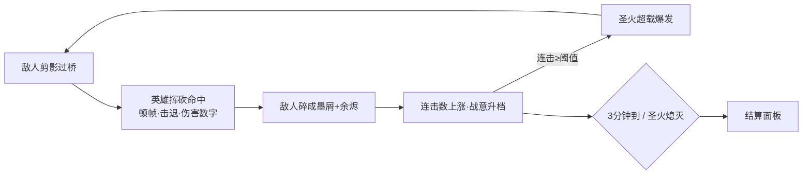
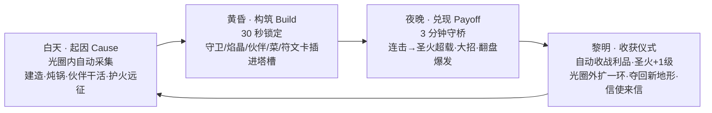
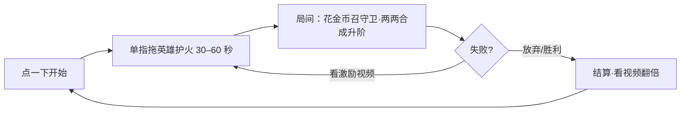

# 圣火守护者玩法总纲 v1（Design Bible v1）

> 版本：v1 · 2026-09-26 · 起草：Grok（执行代理）· 方向由项目负责人批准 · 状态：**草案，待负责人合并**
> 游戏名：圣火守护者 / Flame Guardian（原名「环带值守 Ringwatch」，仓库名 `ringwatch-opus` 与存档键沿用，见 `docs/WHITEPAPER.md` 抬头）。
> 本文地位：定义「一套核心代码、两个产品」的玩法方向、准入规矩和里程碑。**数字凡标「待数值验证」的都是起步值**，由数值经济按第 11 节任务调平后回填。

---

## 0. 与现有文档的关系（先读）

### 0.1 本文参考了哪些文档

> 注意：`main` 目前还是微信小游戏时代的 v3（`README.md`、`DESIGN.md` 为竖屏 420×760、法师 / 弩手）。下列 `docs/` 文件在 PR #3（`claude/gift-card-balance-usage-4coauk`）及其后续分支（如 PR #18 `grok/scene-c1-light`）上，尚未合入 `main`。本文路径按这些分支书写。

| 文档 | 本文沿用的已定事项 |
|---|---|
| `AGENTS.md` | 分工、分支前缀、硬规则 1（素材由代码生成；例外：Noto 字体、登记过的 AI 精灵图）、硬规则 8（机制可借，数值 / 源码 / 美术不照搬）、数值只进 `js/data.js` |
| `DESIGN.md`（PR #3 版） | 战意三档（振奋 / 激昂 / 狂热）、法师「近焰」、击杀反馈、「死亡不委屈」的预警体系、北面山道过桥进村 |
| `docs/WHITEPAPER.md` | 圣火 10 级与圣域半径表（§2.6）、兵营兵种盾卫 / 枪兵 / 弓手（§2.7）、王旗 10 站与郊野祭坛（§2.8）、不做永久数值成长（§8）、Steam 买断无广告（§11、§13） |
| `docs/DESIGN-BACKLOG.md` | 「三态表」原则（本文升格为宪法，见第 4 节）、塔的插槽改造、建筑相性、信使来信、狂欢过载、不能照做清单 |
| `docs/ART.md`、`docs/art-upgrade/FG_ART_BIBLE_001.md` | C1 场景（火光里暖色手绘、圈外冷靛蓝，`RW.C1_LIGHT`）、红色只给危险 / 金色只给奖励、剪影三体型比例 0.6 / 1.1 / 1.4、AI 素材登记表、字体登记 |
| `docs/STEAM.md` | 商店页素材尺寸、Steam Direct 流程、「概念图不得作为商店截图」 |
| `docs/UPGRADE-PLAN.md` | Steam 版每局一次免费复活、没有「看广告刷新」 |
| `README.md`（main） | `RW.AD` 激励视频位的做法（留空 = 预览发放）→ 本文只在手机版沿用 |

### 0.2 本文改动了什么（合并后需回改白皮书）

| # | 旧说法（出处） | 本文新方向 | 回改谁 |
|---|---|---|---|
| 1 | 一局 20 波、18–22 分钟，波间整备（白皮书 §3、§4） | Steam 版改为「白天 → 黄昏 → 夜晚 → 黎明」循环，**一夜 = 一场 3 分钟守桥战**；旧的「波」降级为一夜里的刷怪段 | 游戏策划 |
| 2 | 圣火用金币在整备页升级（白皮书 §2.6） | 守住一夜，**黎明自动升 1 级**，光圈外扩一环；半径表 `RW.SANCTUARY` 原样沿用 | 数值经济 |
| 3 | 整备页随时买卖（DESIGN.md「商店」） | 黄昏 30 秒锁定：一旦入夜，**夜里没有背包、不能换装** | 游戏策划 |
| 4 | 白皮书 §12 的旧里程碑 M0–M4 | 本文第 7 节的新 M0–M3 取代旧编号（旧编号只作历史记录） | 制作人 |
| 5 | 微信小游戏版搁置（AGENTS.md） | 手机版改为**海外超休闲**（Capacitor 包 JS，不重写），微信版继续搁置 | Build/CI |

冲突处理顺序不变：`docs/PLAYER-LOG.md` 的最新条目 > 本文 > 白皮书。

---

## 1. 一句话定位

**守住夜里唯一的暖光：白天在圣火照亮的圆里经营，黄昏把守卫、焰晶、伙伴插进塔里锁定，夜里亲自守桥挥砍、连击引爆圣火超载，黎明收获战利品、火光外扩一环，夺回下一片土地。**

- 一套核心代码，两个产品：
  - **海外超休闲手机版**：单指拖英雄护火，30–60 秒一局，合成守卫，激励视频复活 / 翻倍。用作低成本 CPI 市场测试。
  - **Steam 买断版**：无广告；循环 = 起因（Cause）→ 构筑（Build）→ 兑现（Payoff）。
- 共同核心先做：**3 分钟夜战**——英雄守桥、挥砍、伤害数字弹出、敌人碎裂、结算面板。**手感不好，其他一律不做。**

---

## 2. 核心循环图

### 2.1 共同核心（两个产品都跑这一段）

### 2.2 Steam 版：一天一夜

### 2.3 超休闲版：一局

---

## 3. 两个产品的差异表

| 维度 | 超休闲手机版 | Steam 版 |
|---|---|---|
| 目的 | CPI 市场测试：验证「护火 + 挥砍碎裂」这个钩子便宜不便宜 | 主产品，买断制，AAA 质感追求 |
| 发行 | 海外超休闲发行商（Supersonic / Voodoo 一类）代发 | Steamworks 自发行 |
| 平台 / 画面 | Android / iOS，竖屏（逻辑 420×760 起步，沿用旧小游戏分辨率） | Windows / macOS / Linux / Steam Deck，横屏 16:9（逻辑 960×540） |
| 封装 | 同一份 JS，用 Capacitor 包，不重写 | 同一份 JS，Electron（`desktop/`） |
| 操作 | 单指拖拽移动；攻击全自动 | WASD / 手柄移动；挥砍自动，大招 / 冲刺手动 |
| 一局 | 30–60 秒（默认 45 秒，待数值验证） | 一夜 3 分钟；一天一夜约 6 分钟；Demo 15 分钟；EA 一章 10 夜 |
| 成长 | 局间金币召守卫、两个同阶合成（四守卫三阶） | 昼夜循环：插槽构筑、焰晶、伙伴、炖锅、遗物、符文卡、圣火升级、夺回地形 |
| 广告 | 激励视频：复活、结算翻倍；插屏按发行商规范（不在战斗中弹） | **没有任何广告**，广告代码在 Steam 构建里编译期剔除 |
| 付费 | 广告变现为主（去广告内购可选，待发行商） | 买断；以后付费 DLC，不卖数值 |
| 内容量 | 共同核心 + 合成 + 5 个关卡变体 | 共同核心 + 本文第 5 节全部系统 |
| 叙事 | 无文字，纯视觉 | Inside 式无过场开场 + 巡火信使来信 |
| 成功线 | 见第 8 节 M1 指标（CPI、次留、时长） | 愿望单、Demo 时长与留存、EA 评价 |

**共用的代码（必须在核心里，不许分叉）**：`sim.js` 战斗模拟、挥砍 / 命中 / 碎裂 / 伤害数字、敌人 AI 与流场、连击与超载、守卫合成规则、结算面板数据、`data.js` 数值表（两个产品各自一套覆盖表）。
**只在壳里分叉的**：输入映射、横竖屏布局、广告 SDK、存档路径、平台 SDK（Steamworks / 发行商 SDK）。

---

## 4. 宪法：「三态合一审查」

**规则**：任何实体（系统、单位、道具、事件）进游戏前，必须填满三列：

- **白天（Cause）**：白天它让玩家做什么、得到什么？
- **黄昏插槽（Build）**：黄昏锁定阶段，它怎么被插进塔槽 / 分配？
- **夜间兑现（Payoff）**：夜里守桥时，它怎样变成看得见、听得见的回报？

**任何一列填不出，或者需要一整块新界面，就砍掉（进储备库）。** 复用的界面只有：白天场景内交互、黄昏插槽面板、夜战 HUD、黎明结算 / 三选一卡、信件卡。

超休闲版只需通过「夜间兑现」一列 + 「局间合成」即可，但实体必须来自同一张表。

### 4.1 本次纳入的实体（全部已过审）

| 实体 | 白天（Cause） | 黄昏插槽（Build） | 夜间兑现（Payoff） | 复用界面 |
|---|---|---|---|---|
| **篝火炖锅** | 把夜里掉的怪物残骸 + 木柴丢进圣火旁的锅，按配方炖出一道菜 | 把菜喂给某个插槽里的守卫或伙伴（一菜一单位） | 被喂的单位整夜获得强增益，同时背负代价（例：更肉但更慢） | 场景交互 + 插槽面板 |
| **塔插槽（乐高式组装）** | 用木石在光圈内的塔基上建塔、解锁新槽 | 往塔的「守卫槽 / 焰色槽 / 伙伴槽」里插东西，组合决定塔的行为，不是加数字 | 塔按组合出不同攻击形态（例：弓手 + 霜青 = 冰箭减速） | 插槽面板 |
| **五色焰晶** | 远征 / 信件 / 收获得到焰晶；三颗同色可在圣火里熔成高一阶 | 像宝石一样嵌进焰色槽；同塔两颗同色触发共鸣 | 对克制的敌人剪影 +50% 伤害并附带特效；高阶焰晶改变行为（霜青 III 从减速变冻结） | 插槽面板 |
| **伙伴·水豚（坦克）** | 在圣火边泡汤，光圈内建筑每秒修复 | 插进伙伴槽 | 活体机关：嘲讽桥头敌人、硬吃伤害 | 插槽面板 |
| **伙伴·大鹅（啄击）** | 巡田，农田产出上升 | 插进伙伴槽 | 活体机关：冲出去啄，打断施法、优先啄远程 | 插槽面板 |
| **伙伴·萤火狐（照明）** | 随护火远征出圈，找稀有材料 | 插进伙伴槽 | 身上带一小圈光：光里的敌人现形、受伤增加（C1「光即色彩」的机制化） | 插槽面板 |
| **伙伴·驮羊（搬运）** | 搬运，光圈内采集变快 | 插进伙伴槽 | 活体机关：滚毛球冲撞桥面，击退一排 | 插槽面板 |
| **巡火信使·盲盒** | 黎明收到信，拆开得到随机焰晶 / 菜谱 / 遗物 | 所得物件照常插槽 | 由所得物件兑现 | 信件卡 |
| **巡火信使·神器线索** | 信里给出线索，白天远征去对应地形找残片（共 3 片） | 集齐后神器占一个特殊槽 | 神器的夜间效果（例：初火之冠——超载时长 +50%） | 信件卡 + 插槽面板 |
| **巡火信使·寄养传说兽** | 代养一只传说兽 2 天，每天喂一次菜 | 寄养期间它可以插伙伴槽 | 第 3 夜为「试炼夜」：达成条件则它留下，否则回去 | 信件卡 + 插槽面板 |
| **巡火信使·悬赏** | 接下悬赏（例：用霜青焰击杀 20 只狼骑） | 黄昏按悬赏布置焰色 | 夜里达成条件，黎明发赏 | 信件卡 |
| **Boss 打回原形 → 伙伴 / 坐骑** | 黎明仪式里，原形加入营地，白天干活（石犀开荒，搬更重的石料） | 作为伙伴插槽，或指定为英雄坐骑 | 伙伴：强力活体机关；坐骑：英雄冲撞技能 | 插槽面板 |
| **连击超载（圣火超载）** | 白天：圣火等级决定超载阈值和时长 | 黄昏：符文卡 / 神器可改超载效果 | 夜里连击到阈值，圣火爆发，全塔射速翻倍、英雄挥砍变大 | 夜战 HUD |
| **黎明收获仪式** | 黎明：战利品自动飞回圣火、圣火升级、光圈外扩、新地形亮起 | 为下个黄昏准备：新槽 / 新塔基 | 本质是上一夜兑现的「收尾」，让玩家看到这一夜赚了什么 | 黎明结算 |
| **四守卫三阶进化** | 白天用金币招募守卫（盾卫 / 枪兵 / 弓手 / 司火） | 插进守卫槽；两名同阶合成升一阶 | 守卫在塔前作战，阶数改变外形和招式 | 插槽面板 |
| **遗物（三选一）** | 黎明或 Boss 后三选一（沿用白皮书「祝福」的卡面） | 被动生效，无需插槽 | 夜里的被动效果 | 黎明三选一卡 |
| **符文卡** | 黎明 / 信件得到符文卡 | 黄昏最多刻 2 张在塔上，写成条件触发（「圣火受击时 → 火墙」） | 夜里条件满足时自动释放，不需要背包 | 插槽面板 |
| **大招** | 白天无（大招随英雄固定） | 黄昏可换一张「大招符文」改变形态 | 连击充能，手动释放（手机版自动释放） | 夜战 HUD |
| **翻盘爆发** | 白天无消耗 | 黄昏无需布置（系统保底） | 圣火生命低于 30% 时，下一次超载阈值减半、伤害 +50%，每夜一次 | 夜战 HUD |
| **剪影敌人** | 白天：圈外能看到墨色影子游荡，预告今夜的颜色 | 黄昏：面板预告今夜敌人的剪影与焰色克制 | 夜里剪影进光现色，被砍碎成墨屑 + 余烬 | 夜战 HUD + 插槽面板 |
| **护火远征（资源模式）** | 白天英雄提灯出圈，在冷靛色区域采稀有资源，灯油 60 秒 | 带回的材料变成焰晶 / 菜 / 神器残片再插槽 | 由产物兑现 | 场景交互 |
| **Inside 式开场** | 开局即操控：捧着火种走向祭坛，点燃后标题才出现 | 第一次黄昏被引导插第一个守卫 | 第一夜是教学夜 | 无新界面 |

### 4.2 被砍的例子（说明审查怎么用）

| 提案 | 卡在哪一列 | 结论 |
|---|---|---|
| 天气控制 | 白天有事可做，但黄昏没有插槽位置，夜里兑现需要全屏天气特效和一整套新界面 | 进储备库 |
| 客栈经营 | 白天可做，黄昏、夜晚都没有对应物，需要新界面 | 进储备库 |
| 夜里随时开背包换装 | 违反「夜里不开背包」 | 否决 |

---

## 5. 各系统说明（起步数值一律「待数值验证」）

### 5.1 共同核心：3 分钟夜战（M0）

**场景**：沿用现有地图结构——北面山道过河上桥，桥南是村子与圣火（`js/map.js`）。M0 只打北桥一个方向。

| 项 | 起步值（待数值验证） | 说明 |
|---|---|---|
| 夜长 | 180 秒 | 超休闲版覆盖为 45 秒 |
| 英雄 | 1 名守火人（现有 hero 精灵：提灯法杖法师） | 普攻改为**自动近身挥砍弧**，沿用法师「近焰」：越近越痛 |
| 挥砍 | 伤害 24，间隔 0.45 秒，扇形 120°，半径 70 | 第 3 下为重击：伤害 ×1.8，击退 ×2 |
| 顿帧 | 普通命中 60 ms，击杀 / 重击 100 ms，每秒顿帧上限 200 ms | 防止大群时画面卡住 |
| 击退 | 小鬼 40 px，精英 12 px，Boss 0 | — |
| 伤害数字 | 普通白色，重击大一号暖橙，同屏最多 40 个，0.7 秒淡出 | 不用红（留给危险）、不用金（留给奖励） |
| 碎裂 | 每只敌人碎成 6–10 片墨屑 + 1–3 粒余烬，0.6 秒消散 | 替代现有「翻滚沉地」 |
| 敌人（剪影四类） | 小鬼 HP 30（两刀）/ 狼骑 HP 60 快 / 暗弓手 HP 45 远程 / 精英 HP 300 | 沿用现有敌人名；体型比例按美术圣经 0.6 / 1.1 / 1.4 |
| 刷怪时间轴 | 0–60 s 小鬼 1.2 只 / 秒；60–120 s 加狼骑、暗弓手；120–160 s 精英 2 只 + 潮涌；160–180 s 终潮 | 全夜约 220 只 |
| 圣火 | 生命 1000；敌人摸到圣火每次 -20 | 熄灭即失败 |
| 连击 | 2.0 秒内继续击杀则连击 +1，断了清零 | 与战意并行：战意管属性，连击管超载 |
| 圣火超载 | 连击 50 触发；持续 8 秒；全塔射速 ×2，英雄挥砍半径 +40%；冷却 45 秒 | 超载起爆时全场一次冲击波（伤害 60） |
| 结算面板 | 守住 / 熄灭、用时、击杀数、最高连击、超载次数、圣火剩余、星级（圣火 ≥70% 三星） | 最多 8 个字段，3 秒内可点「再来一夜」 |

**手感硬指标**：见第 8 节 M0 验收。

### 5.2 超休闲手机版

| 项 | 起步值（待数值验证） | 说明 |
|---|---|---|
| 操作 | 单指按住任意处拖动英雄，松手原地站桩；攻击全自动 | 与现有浮动摇杆一致 |
| 一局 | 45 秒（关卡 1–2 为 30 秒，后期 60 秒） | — |
| 守卫格 | 圣火周围 6 个格子 | 局间花金币召唤 1 阶守卫，随机四种之一 |
| 召唤价 | 10 金币起，每次 +15% | — |
| 合成 | 两名同种同阶 → 升一阶，最高 3 阶 | 与 Steam 版同一套合成代码 |
| 产出 | 每杀一只 1 金币，胜利 +20 | 第 1 局内至少能合成一次 |
| 激励视频 | ① 复活（每局 1 次，圣火回满 50%）② 结算金币 ×2 | 沿用 `RW.AD` 结构：ID 留空 = 预览发放；只有完整看完才发奖 |
| 插屏 | 按发行商规范，最早第 3 局后、两次间隔 ≥ 60 秒，**战斗中绝不弹** | — |
| 关卡 | 5 个变体（桥宽、敌人组合、夜长不同） | 每关最多引入 1 个新元素 |

### 5.3 Steam 版：白天（Cause）

- **光圈即领土**：圣火光圈（半径沿用 `RW.SANCTUARY`：200 / 260 / 320 / 390 / 470 / 560 / 660 / 780 / 920 / 全图）内的资源点**自动采集**；圈外是冷靛色墨影区，不自动采。
- **白天时长**：默认 120 秒计时，玩家可随时按「入夜」提前结束（待数值验证）。
- **资源只有三种**：金币（夜战掉落 + 收成）、木石（白天采集，建塔 / 解锁槽）、怪物残骸（夜里掉，只进炖锅）。
- **采集速度**：每个采集点每 3 秒 1 份木石；伙伴驮羊 +30%（待数值验证）。
- **建造**：塔基固定在光圈内的地块上（Thronefall 式固定地块，只借机制）。开局 2 个塔基，圣火 3 / 5 / 7 / 9 级各 +1，最多 6 座塔。
- **护火远征**：英雄提灯出圈，灯油 60 秒，灯灭自动传回圣火（不死）。圈外有稀有材料、神器残片、寄养兽踪迹。
- **篝火炖锅**：见 5.7。

### 5.4 Steam 版：黄昏（Build）—— 30 秒锁定

- 入黄昏后镜头拉到俯视，打开**插槽面板**，倒计时 30 秒；可提前点「锁定」。
- 面板顶部预告今夜：敌人剪影种类、数量档、克制它们的焰色（沿用「整备页预告下一波」的设计）。
- 倒计时结束即锁定，**夜里没有背包、不能换装、不能开商店**。
- 每座塔的起步槽位（待数值验证）：

| 槽 | 起步 | 扩展 |
|---|---|---|
| 守卫槽 | 1 | 塔二级 +1 |
| 焰色槽 | 1 | 圣火 5 级起 +1（可触发同色共鸣） |
| 伙伴槽 | 1 | — |
| 符文位（全局） | 2 张 | 神器可 +1 |

### 5.5 Steam 版：夜晚（Payoff）

- 共同核心的 3 分钟守桥战，塔按插槽组合自动作战，英雄亲自挥砍。
- 夜长随天数：第 1 夜 150 秒（教学），之后 180 秒，Boss 夜 210 秒（待数值验证）。
- Boss 夜：每 5 夜一次（沿用「每 5 波一个 Boss」的节奏）。
- **大招**：连击每 +1 充能 1%，满 100% 可放；英雄固定一个大招，大招符文改形态。
- **翻盘爆发**：圣火 < 30% 时下一次超载阈值减半（50 → 25）、伤害 +50%，每夜一次。

### 5.6 Steam 版：黎明（收获仪式）

- 仪式约 10 秒，可跳过：地上的战利品自动飞回圣火 → 圣火 +1 级 → 光圈外扩一环（半径按上表）→ 镜头拉远（沿用「镜头随等级按平方根拉远」）→ 被照亮的新地形上墨影褪去、显出颜色，成为「夺回的土地」（王旗外推的新表现）。
- 然后依次：遗物三选一（若有）→ 巡火信使来信（每 3 夜一次）→ 进入白天。
- 一章 10 夜，圣火 10 级对应全图光明（与 `RW.SANCTUARY` 10 级一一对应）。
- **不做永久数值成长**：圣火等级、伙伴、坐骑都只在本局 / 本章内有效；局外只解锁内容（白皮书 §8）。

### 5.7 篝火炖锅

- 1 口锅，每个白天炖 1 道（圣火 5 级起 2 道）。配方 = 2–3 种材料，至少 1 份怪物残骸。
- 菜在黄昏喂给一个单位，**只管一夜**。每道菜都带代价：

| 菜 | 材料 | 增益 | 代价 |
|---|---|---|---|
| 巨像骨汤 | 巨像碎石 + 木柴 | 守卫生命 +40% | 移速 -20% |
| 焦糖蝠翼 | 蝠翼 ×2 | 伙伴攻速 +30% | 次日白天该伙伴不干活 |
| 狼骑辣肉 | 狼骑肉 + 余烬 | 暴击 +15% | 受到伤害 +10% |
| 墨影冻 | 墨屑 ×3 | 攻击附带 0.5 秒减速 | 伤害 -10% |
| 萨满药粥 | 萨满羽毛 + 谷物 | 每秒回复 2% 生命 | 不能被圣火治疗 |
| 余烬烤薯 | 余烬 + 薯 | 超载期间该单位伤害 ×2 | 平时伤害 -15% |

（数值全部待数值验证）

### 5.8 塔插槽与五色焰晶

- **乐高式组装，不是加数字**：塔的行为 = 守卫 × 焰色 × 伙伴。例：
  - 弓手 + 霜青 → 冰箭，命中减速 30%
  - 盾卫 + 烬橙 → 燃烧盾墙，接触者灼烧
  - 枪兵 + 皓白 → 破盾突刺
  - 弓手 + 霜青 ×2（共鸣）→ 冰箭改为穿透
- **五色焰晶与克制**（克制：伤害 +50% 并附特效，待数值验证）：

| 焰色 | 特效 | 克制 | 高阶（III）改变行为 |
|---|---|---|---|
| 烬橙 | 范围灼烧 | 小鬼（成群杂兵） | 灼烧可传染 |
| 霜青 | 减速 | 狼骑（快） | 减速 → 冻结 1 秒 |
| 翠绿 | 藤缚定身 | 暗弓手（远程） | 定身范围化 |
| 皓白 | 净化破盾 | 护盾萨满 / 暗影术士（施法） | 净化时回复圣火 |
| 星辉（淡紫蓝） | 百分比破甲 | 崩山巨像 / 铁甲兽（重甲） | 破甲可叠加 |

- 色值避开危险红 `#FF3B3B` 与奖励金；每色另有独立图标形状，色盲也能分（交给游戏美术定稿）。
- 合成：三颗同色同阶 → 高一阶（黎明在圣火里熔炼）。

### 5.9 四守卫三阶进化

| 守卫 | 定位 | 1 阶 → 2 阶 → 3 阶（起步值，待数值验证） |
|---|---|---|
| 盾卫 | 拦截、招怪、受伤 -30%（沿用） | 生命 200 → 420 → 900；3 阶解锁「盾冲」 |
| 枪兵 | 打精英 / Boss ×1.6（沿用） | 伤害 18 → 38 → 80；3 阶一次三刺 |
| 弓手 | 远程，射程 160（沿用） | 伤害 12 → 26 → 55；3 阶双发 |
| 司火（新增） | 近圣火的范围火球，给塔补火 | 伤害 10 → 22 → 48（范围）；3 阶每 10 秒回圣火 2% |

- 合成规则：两名同种同阶 → 升一阶。两个产品共用。每阶外形明显变化（剪影可分）。

### 5.10 伙伴动物

| 伙伴 | 白天 | 夜间活体机关（起步值，待数值验证） | 获取 |
|---|---|---|---|
| 水豚 | 泡汤：光圈内建筑每秒修复 2 | 嘲讽半径 90，生命 800 | 第 2 夜黎明固定获得 |
| 大鹅 | 巡田：农田产出 +20% | 每 4 秒啄一次，打断施法、眩晕 0.5 秒，优先远程 | 信使盲盒 / 悬赏 |
| 萤火狐 | 远征同行：稀有材料 +1 | 自带半径 80 的光圈，光内敌人受伤 +15% | 远征中遇到 |
| 驮羊 | 搬运：采集 +30% | 每 12 秒滚毛球冲撞桥面，击退一排 | 商人信件 |

伙伴全部原创造型，禁止影射任何现成角色或品牌。

### 5.11 巡火信使

- 每 3 夜，黎明时信使来一封信，三选一（盲盒 / 神器线索 / 寄养传说兽 / 悬赏里随机 3 种）。
- 神器线索：3 片残片散在远征区域，平均 2–3 个白天集齐。
- 寄养传说兽：代养 2 天，第 3 夜为试炼夜（例：本夜圣火不低于 50%），通过则留下。
- 悬赏：限本夜完成；奖励 = 一颗 2 阶焰晶或 60 金币（待数值验证）。

### 5.12 Boss 打回原形

- Boss 被击败时若**最后一击发生在光圈内**，Boss 褪去墨影，露出原形（被夜污染的动物），黎明仪式里加入营地。
- 起步两例：崩山巨像 → **山背石犀**（坐骑：英雄获得冲撞技，白天可开荒）；蝠母 → **月翼蛾后**（伙伴：夜里扩大光圈 +40）。
- 终局 Boss「灭火者」不可收服（EA 以后再议）。

### 5.13 遗物、符文卡

- 遗物：黎明 / Boss 后三选一，纯被动，沿用白皮书「祝福」的品质预算（普通 1.0 / 精良 1.6 / 稀有 2.5 × 1.2）。
- 符文卡：「条件 → 效果」形式，黄昏刻最多 2 张。例：「圣火受击时 → 桥头火墙 3 秒」「连击到 30 → 全体守卫回 10% 生命」。

### 5.14 Inside 式开场（M2 Demo 起）

- 无过场、无标题画面：进游戏就在冷靛色夜里，捧着一小簇火种。
- 走向祭坛（约 20–30 秒），沿路墨影退让；点燃祭坛后暖色铺开，**这时才出现标题「圣火守护者」**（思源宋体）。
- 紧接第一个黄昏：只开放 1 座塔 1 个守卫槽，教插槽；第一夜为教学夜。

### 5.15 美术方向提要（详见 `docs/ART.md`）

- C1「光即色彩」：火光圈内是饱和暖色手绘，圈外是冷靛蓝剪影 / 水墨。光圈扩一环 = 世界多一圈颜色，**进度就是颜色**。
- 敌人是墨色剪影、眼睛发光；进光现色，被砍碎成墨屑。
- 红色只给危险，金色只给奖励（美术圣经硬规则）。

---

## 6. 两个产品的节奏对照

| 时间尺度 | 超休闲 | Steam |
|---|---|---|
| 1–5 秒 | 拖动、挥砍、碎裂、数字 | 同左 + 大招 |
| 30–60 秒 | 一局 | 一夜里的一个刷怪段 |
| 3 分钟 | 3–5 局 + 合成 | 一夜 |
| 6 分钟 | — | 一天一夜 |
| 15 分钟 | — | Demo：开场 + 2 个完整昼夜 + 第 3 夜 Boss |
| 60 分钟 | — | 一章 10 夜（EA） |

---

## 7. 里程碑

> 日期为建议，由制作人确认后改。

| 里程碑 | 内容 | 建议日期 |
|---|---|---|
| **M0 共同核心夜战 3 分钟** | 5.1 全部：守桥、挥砍、顿帧、伤害数字、碎裂、连击、圣火超载、结算面板；浏览器可玩；横竖屏都能跑 | 2026-10-17 |
| **M1 超休闲测试包 + Steam 商店页 / 愿望单** | ① 5.2 全部 + Capacitor Android / iOS 测试包 + 激励视频接发行商 SDK（预览发放可切换）+ CPI 创意；② Steam 商店页「即将推出」上线，开始收愿望单 | 2026-11-14 |
| **M2 Steam Demo 垂直切片 15 分钟** | Inside 式开场 + 2 个完整昼夜 + 第 3 夜 Boss；插槽、五色焰晶（3 色）、2 只伙伴、炖锅（3 道菜）、1 封信、Boss 打回原形 1 例 | 2027 Q1（参加最近一届新品节前） |
| **M3 EA（抢先体验）** | 第 1 章 10 夜完整、五色焰晶、四守卫三阶、4 伙伴、2 Boss 原形、信使四种信、遗物 / 符文卡、英文 + 手柄 + 成就 + 云存档 | Demo 数据达标后再定 |

---

## 8. 验收标准（可测量）

### M0

| # | 指标 | 标准 | 怎么测 |
|---|---|---|---|
| 1 | 首次击杀时间 | 进游戏到第一次击杀 ≤ 5 秒 | 测试录屏 |
| 2 | 帧时间 | 150 只敌人同屏时，Windows 中端笔记本 p95 ≤ 16.7 ms；中端安卓（浏览器）p95 ≤ 33 ms | 性能记录 |
| 3 | 顿帧 / 击退 / 数字 / 碎裂 | 四项全部可见；每秒顿帧累计 ≤ 200 ms | 逐帧录屏检查 |
| 4 | 超载 | 中等水平玩家每夜至少触发 1 次（5 人中 ≥ 4 人） | 盲测 |
| 5 | 难度 | 中等玩家首夜守住率 60–80% | 盲测 + 无头模拟 |
| 6 | 想再来 | 5 人盲测中 ≥ 4 人主动点「再来一夜」 | 盲测问卷 |
| 7 | 结算 | 结束后 1 秒内出面板，3 秒内可重开 | 计时 |
| 8 | 工程 | `npm run check` 通过；数值全在 `data.js`；`sim.js` 可无头跑完 3 分钟 | CI |

### M1

| # | 指标 | 标准（业界常见门槛，最终以发行商口径为准） |
|---|---|---|
| 1 | 测试包 | Android AAB / APK + iOS TestFlight 各 1 个，冷启动到可玩 ≤ 5 秒 |
| 2 | 广告 | 激励视频没看完不发奖 100%；战斗中 0 次广告；Steam 构建里搜不到广告 SDK |
| 3 | CPI（美国，发行商测试） | 目标 ≤ 0.40 美元（待发行商确认） |
| 4 | 次日留存 D1 | ≥ 35% |
| 5 | 人均日游戏时长 | ≥ 8 分钟 |
| 6 | 创意 | ≥ 5 条 15–30 秒视频，前 3 秒出现「挥砍碎裂 / 护火」画面 |
| 7 | Steam 商店页 | 「即将推出」上线；胶囊图全套 + ≥ 5 张实机 1920×1080 截图 + 预告片；无概念图冒充截图 |
| 8 | 愿望单 | 上线 8 周内 ≥ 2000（待增长情报校准） |

### M2

| # | 指标 | 标准 |
|---|---|---|
| 1 | Demo 时长 | 通关中位数 13–18 分钟 |
| 2 | 完成率 | ≥ 50% 的开始者打完第 3 夜 |
| 3 | 开场 | 不看任何文字，≥ 90% 测试者 40 秒内点燃祭坛 |
| 4 | 三态 | Demo 里每个实体都在第 4 节表里 |
| 5 | Demo 中位游戏时长（Steam 后台） | ≥ 20 分钟（说明有人重玩） |
| 6 | 愿望单转化 | 新品节期间愿望单增长 ≥ 商店页此前总量 |

### M3

| # | 指标 | 标准 |
|---|---|---|
| 1 | 内容 | 第 1 章 10 夜可通关，平均一章 50–70 分钟 |
| 2 | 平衡 | 平衡机器人首章通关率 40–60%（沿用白皮书目标区间） |
| 3 | 稳定 | 崩溃率 < 0.5% 会话 |
| 4 | 评价 | 首月 Steam 好评率 ≥ 80% |
| 5 | 平台 | 手柄全流程可玩、英文全覆盖、成就与云存档接通 |

---

## 9. 储备库（DLC / 续作，**现在明确不做**）

| 条目 | 为什么不做 | 以后若做，先过哪一列 |
|---|---|---|
| 门派外交 | 需要大量剧情和新界面 | 黄昏插槽列 |
| Galgame 好感 | 需要立绘与剧情，新界面 | 三列都缺 |
| 文明 / 英雄无敌式大地图与军队 | 另一种游戏的规模（DESIGN-BACKLOG 第三类已建议后移） | 夜间兑现列 |
| 客栈经营 | 三态只有白天一列 | 黄昏、夜晚列 |
| 联机合作 | 输入与同步工程量大 | 工程评估 |
| 天气控制 | 需要全屏特效与新界面（见 4.2） | 黄昏插槽列 |
| 公版名画博物馆 | 素材规则与新界面（DESIGN-BACKLOG 第四类） | 三列都缺 |

新提案一律先填第 4 节三态表，填满再谈排期。

---

## 10. 合规规矩

### 10.1 原创与素材

1. **机制可以借，代码和美术绝不借。** 不照搬任何游戏的源码、数值表原文、界面排版、角色、美术、音乐（AGENTS.md 硬规则 8）。
2. **所有美术原创。** 概念图、参考图只放 `docs/`，不进安装包。
3. **AI 生成提示词里不写任何竞品名字**（也不写在世艺术家名、商标、真人）。
4. **字体只用 Noto**（Noto Serif SC / Noto Sans SC，SIL OFL 1.1，子集化，许可证同目录），已在 `docs/ART.md` 登记。
5. **AI 素材一律登记在 `docs/ART.md`「AI 素材」**（来源、日期、提示词摘要、后处理），并在 **Steam 后台的 AI 内容披露里如实声明**。
6. **保留过程文件作为原创证据**：PSD / .blend / 草稿 / 分层文件 / git 历史都保留，不删不压平；过程文件放仓库外的项目存档（体积大），`docs/ART.md` 里记录存放位置。
7. 新增任何外部素材或库，先经负责人批准并登记（AGENTS.md 硬规则 1 与例外条款）。

### 10.2 渠道

| 渠道 | 做法 | 注意 |
|---|---|---|
| 海外手机 | 通过超休闲发行商代发，接其 SDK 和买量测试 | 合同里写清 IP 归我们、测试数据共享 |
| TapTap（国内） | 自发行，用于测试招募 / 预约 | 能否开测、能否收费以平台现行规则为准；商业化上线需要版号 |
| Steam | Steamworks 自发行，买断，**无广告** | Steam Direct 费用、「即将推出」期、AI 内容披露（见 `docs/STEAM.md`） |
| 中国大陆商业化 | 需要**软著**（计算机软件著作权登记）、**ICP 备案**（网站 / App 相关）、**版号**（游戏出版审批） | 由制作人排时间线，周期以官方为准 |

---

## 11. M0 / M1 分工（每人 2–4 项交付，只写 M0 / M1）

> 代码改动由派发方启动的 Cursor 云端代理完成；下面各位产出的是**规格、数值、素材、方案**，交付后由派发方落库（建议放 `docs/specs/`、`docs/ART.md` 等对应位置）。

### 游戏策划（3fd51e3c-39c8-41de-a00a-5bd046881219）
1. **M0 夜战规格书**（`docs/specs/M0_NIGHT_BATTLE.md`）：挥砍、连击、超载、失败 / 胜利、结算面板字段。验收：每条规则写明对应的 `data.js` 字段名和默认值；无「待定」；结算字段 ≤ 8；代理拿到能直接实现。
2. **超休闲玩法规格**（`docs/specs/M1_HYPERCASUAL.md`）：单指拖拽、6 格守卫、合成、45 秒局、激励视频两个点位。验收：首局不用文字教学，3 秒内能看懂；广告点位只有复活和翻倍。
3. **白皮书回改稿**：按第 0.2 节 5 处差异写出白皮书的修改稿。验收：逐条对应，无遗漏。
4. **三态提案模板**（一页）。验收：任何人 10 分钟能填完一份；用它复核第 4.1 节全部实体。

### 数值经济（ad432ead-9266-4df6-ad08-5018e15d2bfd）
1. **M0 数值表**（`docs/specs/M0_NUMBERS.md` + CSV）：英雄挥砍、四类敌人、刷怪曲线、圣火、连击、超载。验收：无头模拟下中等策略首夜守住率 70% ± 10%，每夜至少触发 1 次超载；每个数值给出 `data.js` 字段映射。
2. **手感常量表**（与打击特效共订）：顿帧、击退、屏震、伤害数字。验收：每项有默认值 + 可调范围 + 每秒上限。
3. **超休闲经济曲线**：金币产出、召唤价、合成、翻倍奖励。验收：第 1 局能合成到 2 阶，第 3 局能到 3 阶；翻倍奖励不超过单局收益的 2 倍；给出 10 局收益表。

### 关卡 / 任务设计（9089c037-bbf1-4eac-8c30-ee0264b4c817）
1. **M0 守桥战场白盒**：基于 `js/map.js` 的北桥，标出桥宽、刷怪点、圣火位置、英雄站位。验收：字符地图草案可直接替换；英雄从圣火走到桥头 ≤ 4 秒。
2. **3 分钟刷怪时间轴**（与数值共订）：验收：每 10 秒一格，含 3 个压力峰、1 个喘息段、最后 20 秒终潮；标注每段的教学意图。
3. **超休闲 5 个关卡变体**（竖屏）：验收：每关 30–60 秒，每关最多引入 1 个新元素，附难度递进说明。

### 打击特效（fe6be72f-f3b9-4d9b-a09e-3252ebfa39cb）
1. **打击感规格**：挥砍弧、命中闪白、墨屑碎裂、余烬、伤害数字样式与时序。验收：每项有参数表 + 时序图；150 只敌人同屏时特效开销 ≤ 2 ms / 帧。
2. **圣火超载演出分镜**（起爆 1.5 秒 + 持续 8 秒 + 收尾）：验收：画面中央 50% 不放大面积不透明特效；遵守红给危险、金给奖励。
3. **移动端简化特效清单**：验收：中端安卓特效开销 ≤ 1 ms / 帧，列出降级顺序。

### 游戏音频（3ce36073-e2b4-425b-95ca-cf5aa5bc0fb6）
1. **M0 音效规格**：挥砍（≥ 3 变体）、命中、重击、碎裂、连击音阶攀升、超载起爆、结算。验收：每条写清触发条件、变体数、同时最大发声数；全部可用代码合成（硬规则 1）。
2. **夜战 3 分钟音乐结构**：中速凯尔特，强度三段 + 超载段 + 结算短句。验收：符合 `docs/PLAYER-LOG.md` 的风格（不要重金属、方波、锯齿波）；给出响度目标，解决「音乐偏小声」的旧问题。
3. **超休闲音频精简规格**：验收：默认静音也能玩（纯视觉反馈足够），包体增量 0（代码合成）。

### 游戏美术（c4bff26f-6224-42e5-b175-afb674f2420d）
1. **C1 夜战桥头关键画面与色值表**：验收：光圈内暖、圈外冷靛；缩到 231×87 并转黑白剪影，英雄、圣火、塔、敌人四类仍可分。
2. **剪影敌人四类 + 墨屑碎裂风格**：验收：体型比例 0.6 / 1.1 / 1.4；进光现色的前后对比图。
3. **五色焰晶色值 + 图标形状**：验收：避开危险红和奖励金；色盲模拟下靠形状仍可分。
4. **M1 用英雄与四守卫 1 阶精灵**（如用 AI）：验收：在 `docs/ART.md`「AI 素材」登记，提示词不含竞品名；保留过程文件。

### 游戏测试（43f8a39e-d9ab-4001-b0ee-20a7455d4697）
1. **M0 手感验收方案 + 5 人盲测问卷**：验收：覆盖第 8 节 M0 的 8 条指标，每条有记录表。
2. **设备与性能矩阵**：Windows 中端笔记本、Steam Deck（若有）、中端安卓、iPhone。验收：每台记录 p95 帧时间与截图。
3. **M1 测试包冒烟清单**：验收：激励视频没看完不发奖 100%；战斗中 0 广告；Steam 构建里没有广告 SDK。

### meme 尤里 · 叙事增长（1dea0c77-34a8-4d13-98d4-ea7f3470038b）
1. **伙伴人设卡**（水豚、大鹅、萤火狐、驮羊）：验收：每只 ≤ 30 字人设 + 1 个适合短视频的招牌动作；全部原创，不影射真人、品牌、现成角色。
2. **超休闲 CPI 创意脚本 5 条**（15–30 秒）：验收：前 3 秒出现挥砍碎裂或护火画面；不出现竞品名、真人、商标；只用实机或原创素材。
3. **TapTap 预约 / 社媒文案包**（中英）：验收：与 `docs/STEAM.md` 商店文案口径一致，不承诺未实现的功能。

### 宣发主视觉 · 增长情报（b2c007d6-9981-4be2-af70-d88bce425511）
1. **Steam 商店页主视觉与胶囊图全套草案**（尺寸按 `docs/STEAM.md`）：验收：462×174 小胶囊下标题可读；只用原创或已登记素材；概念图不冒充截图。
2. **品类情报简报**：超休闲发行商的 CPI / 留存门槛、同类 Steam 游戏愿望单基线。验收：每个数字带来源链接和日期；据此校准第 8 节 M1 指标。
3. **愿望单增长计划**（商店页上线后 8 周）：验收：每周目标、渠道、负责人、复盘节点。

### Build / CI · 平台包（77c18605-6251-4a84-bdcc-f12b19e64779）
1. **一套代码三个壳的方案**（Electron / Capacitor / Web）：验收：列出每个平台的入口、横竖屏、存档路径、广告 SDK 开关（Steam 构建编译期剔除）；交给代理可直接实现。
2. **CI 计划**：check、截图、性能预算、打包产物。验收：每个 PR 产出 Windows 包 + Android 调试包；帧时间超标报警阈值写明。
3. **Steamworks 与发行商 SDK 准备清单**：AppID、Depot、「即将推出」页、发行商测试包提交流程。验收：逐项有负责人、状态、预计日期。

### 制作统筹 / 制作人（e194bc45-c0c8-4ebf-aff8-167aac448b9f）
1. **M0 / M1 排期与依赖图**：验收：每项有负责人、截止日期、验收人；关键路径标出。
2. **决策登记**：第 0.2 节 5 处改动、开放 PR（#1–#20）的去留建议。验收：每项有结论和日期。
3. **合规时间线**：软著、ICP、版号、TapTap、Steam 账户与 AI 披露。验收：材料清单 + 预计周期（注明以官方为准）。
4. **M0 验收会**：按第 8 节 M0 表逐条打勾。验收：会议记录 + 未达标项的补救计划。
