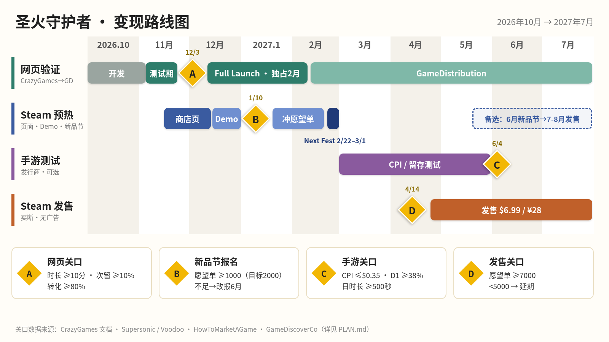

# 《圣火守护者》(Ringwatch) 变现计划 v1

> 编写日期：2026-09-26（北京时间）｜适用：个人开发者（中国大陆）、JS + Three.js 网页游戏、3 分钟一局的夜间守桥（动作 + 塔防）
> 规则：**标注 [来源N] 的数字来自下方来源列表**；**标注【估算】的数字是我推算的，写明了依据**；来源是开发者自述/问卷的，也会注明，不当作官方数据。

---

## 0. 一页结论（TL;DR）

1. **网页（CrazyGames）主要用来验证玩法，挣不了多少钱。** 开发者自述的收入大约是 **每千次游玩 1–2 美元/欧元** [3][4][5]。所以 10 万次游玩 ≈ 100–200 美元【估算，依据 [3][4][5]】。它真正的价值是：用最便宜的方式拿到**平均时长、次留**这两个真实数据，决定后面值不值得继续投入。
2. **Steam 买断才是主要收入来源**，而收入多少几乎完全取决于**发售时的愿望单数量**。目标是 Next Fest 前 ≥2,000，发售前 ≥7,000（进入"热门即将推出"的经验门槛）[13][15]；少于 5,000 愿望单就是 HTMAG 的"铜档"水平 [12]。
3. **Next Fest 定在 2027 年 2 月（2/22–3/1）**，1/10 截止报名，1/25 前交 Demo 审核 [14]。**每款游戏一辈子只能参加一次 Next Fest** [14]，所以如果 1 月初愿望单还不到 1,000，就改报 2027 年 6 月那一届（6/14–21）[14]。
4. **定价建议 6.99 美元 / 国区约 ¥28**（同类参考：吸血鬼幸存者、土豆兄弟 4.99 美元/¥22–25，Halls of Torment 6.66 美元/¥28，Thronefall 12.99 美元/¥52 [20]）。售价超过 10 美元的游戏，首周转化率中位数从 0.15× 降到 0.10× [11]。
5. **手游超休闲测试只作为"顺便买个彩票"**：Android 上 CPI 要 ≤0.25–0.35 美元、D1 ≥38–40%、D7 ≥8–15%，另外需要当天游戏时长 500–1000 秒 [6][7][8][9]。这些门槛很高，而且要注意发行合同里 IP 归属不能影响 Steam 版本 [18]。
6. **开发顺序要改一处**：CrazyGames 的成功标准是**平均时长 10 分钟以上、次留 10–15%** [1]。一局只有 3 分钟，意味着玩家平均要连续玩 3 局以上，所以**局外养成（meta）的最小版本要提前到 Basic Launch 之前做**，而不是排在第三位。

---

## 1. 时间线总览（2026-10 → 2027 年中）

| 阶段 | 时间 | 做什么 | 关口（Go/No-Go） |
|---|---|---|---|
| S0 开发 | 2026-10 → 11 月上旬 | 打磨夜战手感、做 3 选 1、做最小版局外养成，包体 ≤20MB | — |
| S1 网页 | 11 月上/中旬 CrazyGames Basic Launch（7–21 天）→ 12 月 Full Launch → 2027-02 以后上 GameDistribution | 测试版不接广告；正式版接 SDK 和激励视频 | **关口 A**（约 11 月底–12 月初）：平均时长 ≥10 分钟、次留 ≥10%、转化率 ≥80% |
| S2 Steam 预热 | 2026-11 中旬上线 Coming Soon 页 → 12 月中旬到 1 月上旬放出公开 Demo → 2027-02-22 Next Fest | 商店页、Demo（单独页面）、找主播 | **关口 B**（2027-01-10 报名截止前）：愿望单 ≥1,000（最好 ≥2,000），否则改报 6 月 |
| S3 手游测试 | 2027-03 → 05（前提是通过关口 A，且不耽误 Steam） | 包装 Android 版，提交给发行商的测试平台 | **关口 C**：CPI、D1、游戏时长（见 §5） |
| S4 Steam 发售 | 2027-04 下旬 → 05（Next Fest 后 6–10 周）；备选：6 月 Next Fest 后 7–8 月发售 | 买断 6.99 美元，无广告 | **关口 D**（发售前）：愿望单 ≥5,000 才发售，目标 ≥7,000 |

---

## 2. 阶段 S0：开发（2026-10 → 11 月上旬）

**开发顺序（调整后）**
1. **夜战手感**（10 月）：打击反馈、桥头压迫感。
2. **3 选 1**（10 月下旬）：3 分钟一局里安排 3–4 次选择；刷新（reroll）功能先用局内金币实现（后面激励视频要用到，而且 CrazyGames 要求激励奖励必须有非广告的替代获取方式 [2]）。
3. **最小局外养成**（11 月上旬，**提前**）：一种局外货币 + 3–5 个永久升级 + 每日首局奖励。原因是 CrazyGames 提高次留的官方建议就是"有意义的成长、每日钩子、保存进度" [1]。
4. **Inside 式开场**（放到 12 月–1 月，给 Steam Demo 用）。网页版要**能跳过、控制在 60 秒内**：CrazyGames 的转化率指的是"开始后玩满 1 分钟的玩家比例"，头部游戏在 80% 以上，加载不到 10 秒，包体不到 20MB [1]；正式版还要求**直接进入玩法** [21]。

**技术红线**
- 首包 ≤50MB（强制），**≤20MB 才能进移动端首页** [22]；目标 ≤20MB。
- **WebGL2 风险**：three.js 从 r163 起只支持 WebGL2 [23]。有 CrazyGames 开发者报告，切换到 WebGL2 以后，因为低收入地区设备不支持，跳出率上升约 5%，**收入掉了 1/3**，改回去之后才恢复 [5]。**上线前要检查 `WebGL2RenderingContext` 的覆盖率，并准备降级提示页或锁定 r162 版本**（二选一）。

---

## 3. 阶段 S1：网页发行（CrazyGames → GameDistribution）

### 3.1 规则与分成（来源）
| 平台 | 分成 / 条款 |
|---|---|
| CrazyGames | Basic Launch 测试期 **7–21 天**（至少 7 天且满 500 次游玩），**这个阶段没有广告收入** [1][21]。正式版需要 SDK 和完整 QA [21]。默认**非独占**；可以选择**正式上线后 2 个月网页独占，报酬 +50%** [19]。主文档里没有公开分成比例；2026 年 GameMaker Jam 的条款是开发者拿广告收入的 60% [3]。付款门槛 €100 [3]。玩法累计 5 万次后官方提供 SDK 技术支持 [21]。 |
| GameDistribution | 开发者分 **33%**，门槛 €100，月报出来后 60 天内付款 [24]；**前贴片和中插广告是强制的** [25]。论坛上有拖欠款、收入被清零的投诉（2019–2020 年）[26]。 |
| Poki（对比） | Poki 带来的流量 50/50 分成，自带流量 100% 归开发者，但**要求网页独占（默认 5 年）**；已经在别的网页平台上线的游戏只能拿一次性授权费 [27][28]。Poki 员工在公开问答里说开发者收入中位数约 **1,600 美元/月**（按开发者算，不是按游戏算）[29]。 |

> **决策点**：先上 CrazyGames 再上 GD，就等于**放弃了 Poki 的独占分成**。如果想保留 Poki 这个选项，要在 Basic Launch 之前先投 Poki。本计划按你原来的方案走（CG → GD），并建议**选择 CG 的 2 个月独占（+50%）**，独占期结束后再上 GD。

### 3.2 收入预期
- 开发者自述数据：50 万玩家 / 2 周 ≈ €500，第一个月约 €950（人均时长 9 分钟，多人足球游戏）[3]；8 款游戏 45.1 万次游玩 ≈ €557（≈ €1.2/千次，数据较老）[4]；约 3.6 万次游玩 ≈ 37 美元（≈ 1.0 美元/千次，Reddit，二手汇总）[30]；一款增量肉鸽在 CG 上日收入约 €31（年化约 1.29 万美元，签了 Originals 独家分成）[5]。
- 激励视频 eCPM（毛）：美国 15–28 美元、欧盟 8–15 美元、三级市场 1–3 美元 [3]（这组数字很可能掺了移动端数据，网页实际可能更低 [31]）。
- 【估算】如果 CG 正式版前 3 个月累计 5–30 万次游玩 × 1–2 美元/千次 ≈ **50–600 美元**（依据 [3][4][30]）；做到 Liquid Swarm 那样的头部水平约 €900/月 [5]。**不要指望网页收入养活开发。**

### 3.3 关口 A（Basic Launch 结束时，约 2026-11 底–12 初）
| 指标 | Go | 观察/改进 | No-Go |
|---|---|---|---|
| 平均单次时长 | **≥10 分钟** [1] | 6–10 分钟：加强局外养成，再测 1 轮 | <6 分钟【估算阈值】 |
| 次留 D1 | **≥10%（强势是 10–15%）** [1] | 6–10% | <6%【估算阈值】 |
| 转化率（玩满 1 分钟） | **≥80%** [1] | 65–80%：缩短开场、减小包体 | — |

- **Go** → 接入 SDK 做 Full Launch（12 月），同时把"网页数据好"写进 Steam 和发行商的宣传材料。
- **No-Go** → 网页线停在这里，**Steam 线继续**（Steam 玩家对 3 分钟一局肉鸽塔防的耐心和网页玩家不一样），但要先重做核心循环再出 Demo。

---

## 4. 广告设计（网页版专用；Steam 版没有广告）

平台规则摘要 [2][32][33]：激励视频必须**可选、清楚标注、不能在游戏进行中的画面出现、不能连续看多条、只在 `adFinished` 回调后发奖**，`adError` 时不发奖；"跳过"按钮要和"看广告"按钮**同样大小和颜色**；奖励必须有非广告的获取途径；**不能每次死亡都弹复活广告**；复活类广告建议**每次会话限 1 次** [32]；同一个间歇点里，中插广告和"看广告继续"只能二选一 [2]。中插广告由 SDK 控制频率，**最多每 3 分钟一次** [2][33]；首条中插建议等玩家玩了 3–5 分钟或过了第 3–4 关以后再出 [33]。玩家开了广告拦截也必须能正常游戏 [2]。

| 点位 | 触发时机 | 频率上限 | 替代获取（必须有） | 备注 |
|---|---|---|---|---|
| ① 复活 | 圣火熄灭时，**只在最后 1–2 波或打 Boss 时**弹出（"差一点就守住"的时刻） | **每次会话 1 次** [32] | 局外道具"余烬护符"可以免费复活 1 次 | 弹出复活时**不再请求中插** [2] |
| ② 结算 ×2 | 结算界面，翻倍的是局外货币 | 每局 1 次；**前 2 局不出现**【设计】 | 无（翻倍本身是额外奖励；按 [2] 的建议，把"领取"按钮做得同样显眼） | 看了激励视频的这一局，不再请求中插 |
| ③ 3 选 1 刷新 | 3 选 1 界面（游戏已暂停）上的"刷新"按钮带视频图标 | 每局 1 次，按钮上显示剩余次数 | 局内金币刷新（价格逐次上升） | 必须是暂停界面；如果 QA 认为属于"游戏进行中"，就改成只在波次间的商店出现 |
| ④ 中插 | 回到主菜单或结算后点"再来一局"之前 | SDK 控制 ≤1 次/3 分钟 [2] | — | 新玩家第一次会话的前 2 局不请求【依据 [33]】 |
| 横幅 | 只放在局外养成/商店界面 | ≤2 个 [2] | — | 游戏中不放 |

**监控指标**：每位玩家的广告展示数、首次中插那一局的留存断崖、看广告后是否马上退出 [33]；激励视频点击率（opt-in）的行业常见值是 30–60%（二手汇总，未核实原始出处 [34]），拿来作参考就行。
**GameDistribution 版**：要额外加前贴片和中插（GD 强制）[25]，其余照搬。

---

## 5. 阶段 S3：手游超休闲/混合休闲发行商测试（2027-03 → 05，可选）

| 发行商 | 公开或报道的门槛 | 分成/合同 |
|---|---|---|
| Supersonic | **Android CPI <0.25 美元属于好；0.25–0.35 可以边改边测；0.35–0.45 基本放弃** [7]；营销性测试目标 CPI <0.35 美元 [8]；**D1 40–50%、D7 10–15%、游戏时长 500–1000 秒** [8]；Android D1 ≥38% [6]；首日内容约 15 分钟，每关完成率 98% [9] | 没有公开标准分成；合作条款可定制，官网称开发者保留 IP [35] |
| Voodoo | 2019 年起放宽到 **D1 45%、D7 13%、CPI 0.20 美元**（iOS）[10]；**Android：CPI 0.10 美元、D1 38%、D7 8%** [36] | 没有公开 |
| CrazyLabs | "Publishing For All"：**CPI ≤0.80 美元**，留存和 ARPU 逐个评估，游戏保留在开发者自己的账号下 [37] | 按项目谈 |
| Homa | 按项目谈；Homa Jam 给过 50% 发行分成 [38]；**条款里有 IP 转让的内容** [18] | ⚠ 必须把 PC/Steam 权利排除在外 |
| SayGames | 不公开固定的 CPI/留存门槛，更看重长期测试 [39] | 按项目谈 |
| 混合休闲参考 | D7 约 20%、D30 约 10%；目标 D7 15–20% [40]；塔防混合品类 Raid Rush 前 5 个月收入 760 万美元 [40] | — |

**关口 C（Go/No-Go）**：Android CPI ≤0.35 美元 **并且** D1 ≥38% **并且** D0 游戏时长 ≥500 秒 → 进入迭代或签约；CPI 在 0.35–0.80 美元之间且留存好 → 试 CrazyLabs PFA [37]；否则放弃手游，精力全部回到 Steam。
**要做的东西**：竖屏或单手操作版本（桥的纵深很适合竖屏）、15 分钟首日内容 [9]、10–15 秒的广告素材（夜色 + 火焰 + 一波敌人被清空的画面）。
**风险**：发行商 SDK 很多是以 Unity 为主的，JS 游戏需要用 WebView/Capacitor 包一层，**兼容性要先问清楚**【待核实】；时间最多给 2 周，**不能挤占 Steam Demo 的工作**。

**自己发 Google Play + AdMob**：可行但不建议当主线。中国大陆个人可以用电汇收 AdMob 的钱 [41]；**2023-11-13 之后注册的个人账号，必须先做 12 人 × 连续 14 天的封闭测试才能申请上架正式版** [42]。没有买量预算的话，超休闲游戏的自然下载量会很低【估算】。

---

## 6. 阶段 S2 + S4：Steam

### 6.1 基准数据
| 项 | 数据 |
|---|---|
| 商店页刚上线时的愿望单 | 铜档 23–68 / 银档 79–441 [12] |
| 平时每周新增愿望单 | 铜档 0–40 / 银档 15–120 / 金档 100–700 [12] |
| Demo 游戏时长中位数 | 铜档 7 分钟 / 银档 18 分钟 / 金档 38 分钟 [12] |
| Next Fest 新增愿望单（2026 年 2 月问卷） | 进 Fest 前 0–999 愿望单：中位数 322；1,000–9,999：中位数 1,006 [13]；**问卷中位数 806，但 GameDiscoverCo 估计全部 Demo 的真实中位数只有约 200** [14] |
| Next Fest 策略 | Demo **提前 1 个月以上**上线，愿望单约为临时上线的 **2.5 倍**；进 Fest 前 ≥2,000 愿望单表现更好；Demo 用单独页面 [13] |
| Demo 转化率（玩过并加愿望单 ÷ 总玩家） | 中位数 16.3%，70 分位 20% [13] |
| 发售时建议的愿望单数 | 铜档 5,000 / 银档 8,000 / 金档 50,000 [12]；进"热门即将推出"约需 5,500–7,000 [15] |
| 首周销量 ÷ 愿望单 | 2024–25 年，愿望单 >2.5 万的游戏中位数 **0.15×**；**售价 >10 美元的 0.10×** [11]；愿望单 <5k 的游戏中位数约 15%（2020 年数据）[12] |
| Demo 案例 | Parcel Simulator：没有 Demo 时每天约 11 个愿望单，放出 Demo 后每天约 362 个，发售时 4.2 万愿望单 [16] |
| Valve 分成 | 净收入前 1,000 万美元抽 30%，1,000 万–5,000 万抽 25%，5,000 万以上抽 20% [17]；Steam Direct 上架费 100 美元，调整后总收入满 1,000 美元时返还 [17] |
| 税 | 个人填 W-8BEN，提供身份证号作为 TIN，按中美税收协定美国来源收入预扣约 10% [43]；回国后按中国税法申报 |
| 简体中文用户占比 | Steam 硬件调查中简体中文占 **23.97%**（2026 年 8 月调查页面，抓取于 2026-09-26）[44]；**国区定价和中文本地化非常重要** |
| Next Fest 日期 | 2027-02-22 → 03-01；12/8 官方问答会；**1/10 报名截止；1/25 交 Demo 参加 Press Preview 审核**；2/8 所有材料截止；2/11 Press Preview 开始；下一届是 2027-06-14 → 21 [14] |

### 6.2 定价（同类游戏，2026-09-26 从 Steam 商店 API 抓取的原价 [20]）
| 游戏 | 美区 | 国区 |
|---|---|---|
| Vampire Survivors | 4.99 美元 | ¥25 |
| Brotato / 20 Minutes Till Dawn | 4.99 美元 | ¥22 |
| Halls of Torment | 6.66 美元 | ¥28 |
| Thronefall（最接近的防守混合） | 12.99 美元 | ¥52 |
| Deep Rock Galactic: Survivor | 12.99 美元 | ¥52 |
| Rogue Tower | 14.99 美元 | ¥50 |
| Bad North | 14.99 美元 | ¥58 |

**建议**：**6.99 美元 / ¥28**（国区价格按同类游戏"美区价 × 4.0–4.4"推算【估算，依据上表】），首发打 10–15% 折扣。
- 不定 9.99 美元以上的原因：一局 3 分钟、个人开发、内容量对标的是 4.99–6.99 美元这一档；另外售价 >10 美元的游戏转化率中位数会掉到 0.10× [11]。
- 可以升到 7.99–9.99 美元的条件：Demo 游戏时长中位数 ≥38 分钟（金档）[12]，而且完整版有 ≥3 张地图/桥和 ≥2 名角色【设计判断】。

### 6.3 收入情景【全部是估算】
公式：首周销量 = 发售时愿望单 × 转化倍数；每份到手 ≈ 6.99 × 0.75（区域价和首发折扣的折算，**这个 0.75 是我假设的**）× 0.7（扣 Valve 30%）× 0.9（扣预扣税）≈ **3.3 美元**。
| 发售时愿望单 | ×0.10 [11] | ×0.15 [11] | 首周到手（×0.15） |
|---|---|---|---|
| 3,000 | 300 份 | 450 份 | 约 1,500 美元 |
| 7,000 | 700 份 | 1,050 份 | 约 3,500 美元 |
| 20,000 | 2,000 份 | 3,000 份 | 约 9,900 美元 |
（首周之后的长尾销量这次没找到可靠的倍数来源，所以没有写进来。）

### 6.4 S2 要做的东西
- **Coming Soon 页（2026-11 中旬）**：胶囊图要在 462×174 的小尺寸下也能看清 [14]；30 秒预告片，开头 5 秒就要出现"夜、桥、圣火、敌潮"；中英双语，标签选 Tower Defense / Roguelite / Action。
- **Demo（2026-12 中旬到 2027-01 上旬公开，单独页面）**：包含开场 + 1 座桥 + 完整的 3 选 1 + 最小局外养成，目标游戏时长中位数 ≥18 分钟（银档）[12]；可以先在 itch.io 同步发布，收集反馈并写开发日志（itch 默认只抽 10% [3]，但它是卖给已有受众的地方，不是引流渠道）。
- **桌面打包**：用 Electron / NW.js / Tauri 把 Three.js 游戏包成桌面版（【待核实】适配 Steam Deck 和 Steam 成就）。
- **主播外联**：参考 Parcel Simulator 的邮件模板（简短、要点列表、附截图）[16]。
- **TapTap 国际版**：个人可以注册开发者账号、上传游戏，审核约 2 个工作日 [45]。主要用于分发和社区，**本计划里优先级低**（可以等 Steam 发售后再放 PC Demo）。

### 6.5 关口 B / D
- **关口 B（2027-01-10 报名截止前）**：愿望单 ≥1,000 就报 2 月 Next Fest；**不到 1,000 就改报 6 月那届**（6/14–21），发售顺延到 7–8 月。理由：进 Fest 前愿望单 0–999 的游戏，Fest 期间中位数只加 322 [13]，而每款游戏只能参加一次 [14]。
- **关口 D（发售前 2 周）**：愿望单 **≥7,000 → 按计划发售**（有机会进热门即将推出 [15]）；5,000–7,000 → 可以发售，但要提前集中找主播；**<5,000 → 发售日推迟 4–8 周**，继续靠 Demo 和各种 Steam 主题节积累。另外可以考虑卡在季节性大促开始前发售（Parcel Simulator 的案例 [16]）。

---

## 7. 风险清单
| # | 风险 | 影响 | 对策 |
|---|---|---|---|
| 1 | 一局 3 分钟导致网页平均时长达不到 10 分钟 | 关口 A 过不了 | 提前做局外养成；结算页放"再来一局"大按钮，并用每日首局奖励吸引回来 |
| 2 | 用 WebGL2 后低端设备跳出率高 | 收入 −1/3 的先例 [5] | 检测覆盖率，出降级提示或锁定 r162 [23] |
| 3 | 网页收入远低于预期 | 现金流 | 网页只当验证渠道；主要收入靠 Steam |
| 4 | GameDistribution 付款慢或有争议 | 回款 | 设 €50 PayPal 门槛 [46]、每月对账；GD 放在 CG 独占期结束之后 |
| 5 | 在 CG 上线后就拿不到 Poki 独占分成 | 机会成本 | Basic Launch 前决定要不要先投 Poki [27][28] |
| 6 | 只有一次 Next Fest 机会 | 愿望单增长受限 | 按关口 B 选 2 月还是 6 月 [14] |
| 7 | 发行商合同里的 IP 转让条款 | 可能影响 Steam 版 | 合同里写明只授权移动端，PC/Steam 权利排除 [18] |
| 8 | 发行商 SDK 以 Unity 为主，和 JS 不兼容 | 手游测试做不了 | 先问清楚；给 2 周时间上限 |
| 9 | 个人所得税 / 外汇 | 到手金额 | W-8BEN 按协定 10% 预扣 [43]；咨询专业税务人员 |
| 10 | 国内版（微信/抖音）继续搁置 | 失去国内渠道 | Steam 国区 ¥28 + 简体中文覆盖约 24% 的 Steam 用户 [44] |
| 11 | 一个人同时推进 4 条线，精力被摊薄 | 质量下降 | 优先级：Steam Demo > 网页 > 手游 |

---

## 8. 来源列表
[1] CrazyGames Basic Launch Guide — https://docs.crazygames.com/resources/basic-launch-metrics/
[2] CrazyGames Advertisement requirements — https://docs.crazygames.com/requirements/ads/
[3] Cinevva, Web Game Monetization (2026, 汇总 Poki/CG/GD/itch 条款与 Playgama eCPM、开发者案例) — https://app.cinevva.com/guides/web-game-monetization ；另：YouTube 开发者自述 1 个月收入 — https://www.youtube.com/watch?v=eWRGdNxx7Yk
[4] DonislawDev, Earnings from my 8 games — https://donislawdev.com/earnings-and-statistics-from-my-8-games-android-ios-webgl/
[5] Liquid Swarm devlog（itch，CrazyGames ~€31/天；搜索摘录，原页 WebFetch 返回 404）— https://mickaelbneron.itch.io/liquid-swarm/devlog/1579269/
[6] Supersonic, 3 Most Important KPIs — https://supersonic.com/learn/blog/the-3-most-important-kpis-for-testing-your-hyper-casual-prototype/
[7] Supersonic, How to Run a CPI Test (Facebook) — https://supersonic.com/learn/blog/how-to-run-a-cpi-test-the-facebook-edition/
[8] Supersonic, Holy Triangle — https://supersonic.com/learn/blog/the-holy-triangle-of-marketability-retention-and-monetization/
[9] PocketGamer.biz, Key to successful hypercasual prototypes — https://www.pocketgamer.biz/the-key-to-successful-hypercasual-prototypes/
[10] GameAnalytics, How Voodoo Lowered KPIs — https://www.gameanalytics.com/blog/how-voodoo-diversified-and-lowered-game-product-kpis
[11] GameDiscoverCo, State of Steam wishlist conversions 2024–25 — https://newsletter.gamediscover.co/p/the-state-of-steam-wishlist-conversions
[12] HowToMarketAGame Benchmarks — https://howtomarketagame.com/benchmarks/
[13] HTMAG, Next Fest benchmarks (Feb 2026) — https://howtomarketagame.com/2025/03/26/benchmarks-how-many-wishlists-can-i-get-from-steam-next-fest/
[14] Steam Page Analyzer, Next Fest 2026/2027 dates（读自 Steamworks）— https://www.steampageanalyzer.com/blog/steam-next-fest-2026-dates ；Steamworks 官方 — https://partner.steamgames.com/doc/marketing/upcoming_events
[15] Game Developer / HTMAG 关于热门即将推出 ~7,000 愿望单 — https://www.gamedeveloper.com/marketing/the-secret-to-using-steam-as-a-developer-is-to-make-valve-earn-their-30-percent ；https://www.steampageanalyzer.com/blog/steam-popular-upcoming-list
[16] HTMAG, The demo effect (Parcel Simulator) — https://howtomarketagame.com/2025/08/26/the-demo-effect-from-7000-wishlists-to-42000/
[17] PC Gamer（Valve 分成阶梯）— https://www.pcgamer.com/valves-new-revenue-sharing-favours-big-budget-games-and-indie-devs-arent-happy/ ；Steam Direct Fee — https://partner.steamgames.com/doc/gettingstarted/appfee
[18] Homa Terms（搜索摘要提及 IP 转让，签约前需逐条核实）— https://www.homagames.com/terms
[19] CrazyGames Developer Terms 2025-08-18（5.5 条：2 个月独占 +50%）— https://files.crazygames.com/documents/developer_terms_20250818.pdf
[20] Steam Store API storesearch（cc=us / cc=cn），2026-09-26 抓取 — https://store.steampowered.com/api/storesearch/?term=Thronefall&cc=us
[21] CrazyGames Docs 首页 / Requirements Intro — https://docs.crazygames.com/ ；https://docs.crazygames.com/requirements/intro/
[22] CrazyGames Technical requirements — https://docs.crazygames.com/requirements/technical/
[23] three.js r163 release（移除 WebGL1）— https://github.com/mrdoob/three.js/releases/tag/r163
[24] GameDistribution Developer Terms（33%）— https://static.gamedistribution.com/terms/developer.html
[25] GameDistribution Developer Guidelines — https://static.gamedistribution.com/developer/developers-guidelines.html
[26] HTML5GameDevs 论坛 "Be careful with GameDistribution" — https://www.html5gamedevs.com/topic/40668-be-careful-with-gamedistribution/
[27] Poki, Working with Poki — https://developers.poki.com/guide/working-with-poki
[28] Poki, Revenue & deal types — https://developers.poki.com/guide/revenue-deal-types
[29] Poki Q&A @ MadeWithDefoldJam 2024 — https://www.youtube.com/watch?v=SQl6xDVs_Bs
[30] Reddit r/gamedev（36,477 次游玩 ≈ 37 美元，经搜索摘要，原帖直连 403）— https://www.reddit.com/r/gamedev/comments/1od9o7h/how_much_of_revenue_do_moderately_successful_web/
[31] Playgama, eCPM for HTML5 games — https://playgama.com/blog/business-faqs/what-ecpm-is-normal-for-html5-games/
[32] CrazyGames Ad Monetization Guide（复活每次会话 1 次）— https://docs.crazygames.com/resources/ad-monetization-guide/
[33] CrazyGames Optimizing Midgame Ads — https://docs.crazygames.com/resources/midgame-ads-pacing/
[34] Unity 激励视频点位 / AdMob 激励广告手册 — https://unity.com/blog/the-fundamentals-of-rewarded-video-ad-placements ；https://admob.google.com/home/resources/rewarded-ads-playbook/
[35] Supersonic 官网 — https://supersonic.com/
[36] PocketGamer.biz, Voodoo opens Android testing (2020) — https://www.pocketgamer.biz/voodoo-opens-android-testing-to-all-partner-studios/
[37] CrazyLabs, Publishing For All — https://www.crazylabs.com/blog/publishing-for-all-crazylabs-offers-publishing-for-the-other-99/
[38] Homa Jam 50% revenue share — https://www.homagames.com/blog/the-new-homa-jam-offers-participants-a-50-publishing-revenue-share
[39] SayGames, hybrid publishing model — https://blog.say.games/posts/why-saygames-believes-hybrid-games-need-a-different-publishing-model
[40] Gamigion, 2025 Hybridcasual Market Overview — https://www.gamigion.com/2025-hybridcasual-market-overview-with-real-data/
[41] AdMob 电汇常见问题 — https://support.google.com/admob/answer/6025222?hl=zh-Hans
[42] Play Console, 新个人账号测试要求 — https://support.google.com/googleplay/android-developer/answer/14151465?hl=en
[43] Steamworks 税务常见问题 — https://partner.steamgames.com/doc/finance/taxfaq?l=schinese ；国区开发者注册经验 — https://blog.sayori.org/posts/steam-dev-work-01/
[44] Steam Hardware & Software Survey — https://store.steampowered.com/hwsurvey/
[45] TapTap Developer Docs — https://developer.taptap.io/docs/store/
[46] GameDistribution FAQ（付款）— https://gamedistribution.com/developers/faq/getting-started/setting-up-and-receiving-your-payment/
