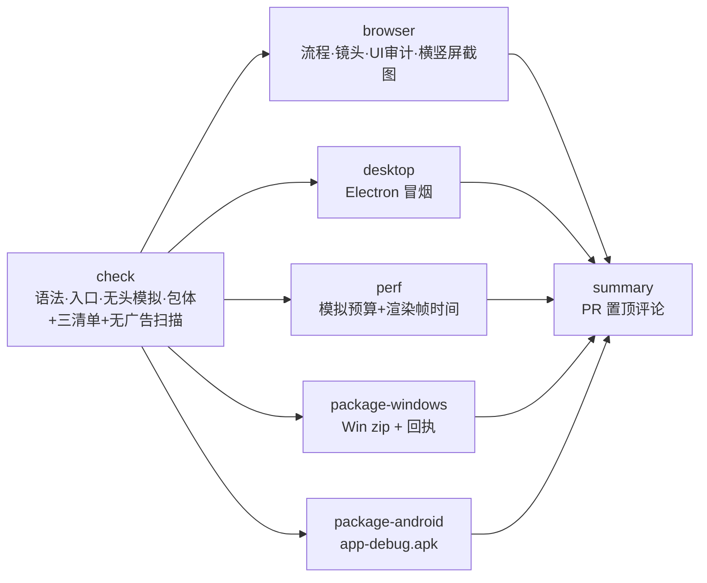

# BUILD-02 CI 计划：自检、截图、性能预算、打包产物

> 版本 v1 · 2026-09-26 · 起草：Build/CI·平台包 · 状态：**方案，待落库并交 Cursor 云端代理实现**
> 依据：`docs/DESIGN_BIBLE_v1.md` §8 M0-2、M0-8、M1-1、M1-2，§11 Build/CI 2、打击特效 1/3。
> 前置：BUILD-01 的 S1–S3（暂存脚本）先落地；Android 调试包依赖 S5。

## 0. 已有的，不重做

集成线（PR #3 / #18 / #20 等分支）上已有两个工作流：

| 工作流 | 触发 | 内容 | 本方案 |
|---|---|---|---|
| `.github/workflows/ci.yml` | push main、所有 PR、手动 | `check`（`node tools/check.js`）；`browser`（`test:flow`、`test:cam`、`audit:ui`、`shots`，上传 `screenshots`）；`desktop`（xvfb 下 `desktop:smoke`，上传 `desktop-smoke.png`）；同分支新提交自动取消旧运行 | **保留全部 job**，在后面追加 |
| `.github/workflows/desktop-build.yml` | 仅手动 | Win / macOS / Linux 三平台 `electron-builder --dir`，上传免安装目录，保留 7 天，不签名 | 保留作「发版用全平台包」；Windows 包改为每个 PR 自动出（见 §3） |

已知现状：
- 最近的 PR 运行一次 15–24 分钟（2026-09-26 的 #18、#19、#20）。新加的 job 必须并行、不串在 `browser` 后面，否则整条会超过 30 分钟。
- `main` 上还没有这两个工作流（`main` 是微信 v3）。PR 的 CI 能跑是因为工作流文件在 PR 分支里。集成线合入 `main` 之后，本方案才对所有分支生效。
- `tools/playtest.js` 已经在测平均帧时间和最大帧时间（第 78–95 行），但只有平均值和最大值，没有 p95，也没有阈值。

## 1. 流水线总图

`check` 失败则其余全部不跑；其余五个并行。

## 2. 每个 job 的内容

### 2.1 `check`（改）

在现有 `node tools/check.js` 基础上增加：
1. 三份加载清单一致（BUILD-01 §4）。
2. `node tools/stage.js --target steam` 后做**无广告扫描**（BUILD-01 §7.3），命中即失败。
3. `sim.js` 无头跑满 3 分钟夜战不抛异常（Bible §8 M0-8；等 M0 夜战规格落地后由 `tools/simtest.js` 增加这一条）。

预计耗时 < 2 分钟，runner `ubuntu-latest`。

### 2.2 `browser`（改）

- 现有步骤不动。
- `tools/shots.js` 增加竖屏视口：**1280×720（横）** 与 **390×844（竖，`?orient=portrait`）** 各截一组，上传到同一个 `screenshots` 产物，子目录 `landscape/`、`portrait/`。
- `audit:ui` 也在竖屏视口再跑一遍（文字出屏 / 按钮装不下 / 文字重叠即失败）。

### 2.3 `desktop`（不改）

继续 xvfb 冒烟。S3 落地后它自动改为测暂存目录版本。

### 2.4 `perf`（新增）

CI 机器没有独显，Chromium 在 CI 里用软件 WebGL，渲染帧时间**不能**代表玩家机器。所以分两部分，职责分清：

| 部分 | 测什么 | 怎么测 | 用途 |
|---|---|---|---|
| A. 模拟预算（**会阻断**） | 150 只敌人同屏时，`sim.js` 每一帧 `update()` 的耗时 | 新增 `tools/perfsim.js`：Node 无头，固定随机种子，强制刷到 150 只敌人，跑 60 秒游戏时间（3600 帧），统计 p50 / p95 / max | 逻辑层回归，结果稳定可比 |
| B. 渲染帧时间（**只报警**） | 浏览器里一整帧的耗时，以及各分段 | Playwright + `?perf=1`：页面内 `RW.Perf` 按段打点（sim / world3d / fx / hud / 合计），跑 60 秒，取 p50 / p95 / 超过 50 ms 的卡顿次数 | 看趋势和相对回归；绝对值以真机为准 |
| C. 真机（**验收用，不在 CI**） | Windows 中端笔记本、中端安卓浏览器 | 游戏测试的设备矩阵（Bible §11 测试 2），同样用 `?perf=1` 导出 JSON | M0 验收的正式数字 |

`RW.Perf`（BUILD-01 之外的一个小改动，交给代理）：只在 `?perf=1` 时启用，按段累积 `performance.now()` 差值，暴露 `RW.Perf.snapshot()` 返回每段 p50 / p95 / max 和卡顿次数。不开时零开销（函数替换为空函数）。

#### 帧时间报警阈值

「基线」指 `main` 最近一次成功运行产出的 `perf-baseline.json`（`perf` job 在 `main` 上运行时上传，PR 运行时下载对比）。

| 指标 | 目标（出处） | 黄色报警（PR 评论标黄，不阻断） | 红色（阻断合并） |
|---|---|---|---|
| A. 模拟 `update()` p95（CI） | 给渲染留足余量 | 比基线慢 ≥ 15%，或绝对值 > 3 ms | 比基线慢 ≥ 30%，或绝对值 > 5 ms |
| B. 渲染合计 p95（CI 软件渲染） | 仅看趋势 | 比基线慢 ≥ 20% | 不阻断 |
| B. 特效段 p95（CI） | 打击特效 ≤ 2 ms（Bible §11 特效 1） | 比基线慢 ≥ 25% | 不阻断 |
| B. 卡顿（单帧 > 50 ms，CI） | — | 60 秒内 > 3 次 | 不阻断 |
| C. Windows 中端笔记本 p95（真机） | ≤ 16.7 ms（Bible §8 M0-2） | > 14.0 ms | > 16.7 ms，M0 验收不通过 |
| C. 中端安卓浏览器 p95（真机） | ≤ 33 ms（Bible §8 M0-2） | > 28 ms | > 33 ms，M0 验收不通过 |
| C. 桌面特效段（真机） | ≤ 2 ms / 帧（Bible §11 特效 1） | > 1.6 ms | > 2 ms |
| C. 移动特效段（真机） | ≤ 1 ms / 帧（Bible §11 特效 3） | > 0.8 ms | > 1 ms |
| C. 每秒顿帧累计 | ≤ 200 ms（Bible §8 M0-3） | > 160 ms | > 200 ms |

说明：
- A 项的 3 ms / 5 ms 是起步值。第一次在 `main` 上跑出基线后，由我按实测把绝对值定为「基线 × 1.5 / × 2」再回填本表。
- 顿帧是故意的画面停顿，统计帧时间 p95 时要排除顿帧期间的帧（`RW.Perf` 在顿帧开始 / 结束时打标记）。
- 基线还不存在时（第一次运行），只输出数字、不报警。

### 2.5 `package-windows`（新增，每个 PR）

runner `windows-latest`：

1. `npm ci`（缓存 npm 与 `~/AppData/Local/electron/Cache`、`electron-builder` 缓存）
2. `node tools/icon.js`
3. `node tools/stage.js --target steam`
4. `npx electron-builder --win --dir --publish never`（`CSC_IDENTITY_AUTO_DISCOVERY=false`，不签名，同现状）
5. 对 `dist/win-unpacked` 解开 `app.asar` 再做一次无广告扫描
6. 压成 `FlameGuardian-win-<短SHA>.zip`，算 zip 的 SHA-256
7. 写回执 `FlameGuardian-win-<短SHA>.json`：完整 commit、分支、PR 号、目标 `steam`、Electron 版本、zip 大小与 SHA-256、`signing: "none"`、`steam_upload_ready: false`、`ads_scan: "pass"`
8. 上传产物 `win-<短SHA>`（zip + 回执），**保留 7 天**

### 2.6 `package-android`（新增，每个 PR）

runner `ubuntu-latest`：

1. `actions/setup-java`（Temurin 21）+ Android SDK（`android-actions/setup-android`）
2. `node tools/stage.js --target mobile`
3. `cd mobile && npm ci && npx cap sync android`
4. `cd mobile/android && ./gradlew assembleDebug`（缓存 Gradle）
5. 产物改名 `FlameGuardian-android-debug-<短SHA>.apk`，算 SHA-256，写同格式回执（目标 `mobile`、`ads` 取值、`signing: "debug"`）
6. 上传产物 `android-<短SHA>`，**保留 7 天**

`mobile/` 还不存在时（BUILD-01 S5 之前）这个 job 用 `if: hashFiles('mobile/capacitor.config.json') != ''` 跳过，并在总结评论里写「Android 调试包：工程未就绪（S5）」。S5 合入后自动生效，届时满足「每个 PR 都出 Android 调试包」。

iOS 不在每个 PR 里出：macOS runner 的计费按 10 倍分钟算，且需要 Apple 开发者账号。M1 起单独一个手动工作流 `ios-testflight.yml` 上传 TestFlight（BUILD-03 P5 就绪后做）。

### 2.7 `summary`（新增）

`if: always()`，汇总前五个 job，用 `actions/github-script` 在 PR 上维护**一条置顶评论**（有就更新，不刷屏），内容：
- 每个 job 通过 / 失败
- Windows zip、Android APK 的下载链接、大小、SHA-256
- 性能表：本次 vs 基线，按上面阈值标绿 / 黄 / 红
- 横竖屏截图各 2 张缩略（链接到产物）

同样内容写进 Actions 的运行摘要页（`$GITHUB_STEP_SUMMARY`）。

## 3. 触发、耗时与成本

| 项 | 设置 |
|---|---|
| 触发 | `pull_request`（所有 PR）、`push` 到 `main`、`workflow_dispatch` |
| 并发 | 沿用 `concurrency: ci-${{ github.ref }}`，同分支新提交取消旧运行 |
| 目标耗时 | 从 push 到 PR 评论出现 ≤ 25 分钟；`package-windows` ≤ 12 分钟、`package-android` ≤ 12 分钟、`perf` ≤ 8 分钟，全部与 `browser` 并行 |
| 产物保留 | 截图 14 天（现状）；Win / Android 包 7 天；`perf-baseline.json`（仅 `main`）30 天 |
| 纯文档 PR | 按验收要求「每个 PR 都出包」，默认照跑。若要省分钟数，可以对只改 `docs/**`、`*.md` 的 PR 跳过两个打包 job，**这是对验收口径的放宽，需要总调度或制作人点头**才启用 |

## 4. 分支保护建议（`main`）

必须通过：`check`、`browser`、`desktop`、`perf`（A 项红色即失败）、`package-windows`、`package-android`（S5 之后）。
不要求：`summary`。

## 5. 交给 Cursor 代理的任务拆分

| # | 任务 | 验收 |
|---|---|---|
| C1 | `check` 增加三清单 + 无广告扫描；`shots` / `audit:ui` 增加竖屏 | 故意在 steam 暂存目录放一个含 `adUnitId` 的文件，`check` 失败；PR 产物里有 `landscape/`、`portrait/` 两组截图 |
| C2 | `RW.Perf` + `tools/perfsim.js` + `perf` job + 基线上传 / 下载 / 对比 | `main` 上运行产出 `perf-baseline.json`；PR 里故意在 `sim.js` 加 5 ms 空循环，`perf` 变红 |
| C3 | `package-windows` job + 回执 | 每个 PR 的运行页有 `win-<短SHA>` 产物，zip 解压后双击能进游戏，回执里 SHA-256 与 zip 一致 |
| C4 | `package-android` job + 回执（依赖 BUILD-01 S5） | 每个 PR 有 `android-<短SHA>` 产物，APK 能装到安卓真机 |
| C5 | `summary` 置顶评论 | 同一个 PR 连推 3 次，只有 1 条评论且内容为最新 |

C1、C3 可以在 BUILD-01 S1–S3 之后马上做；C2 与 M0 夜战同步；C4 等 S5。
