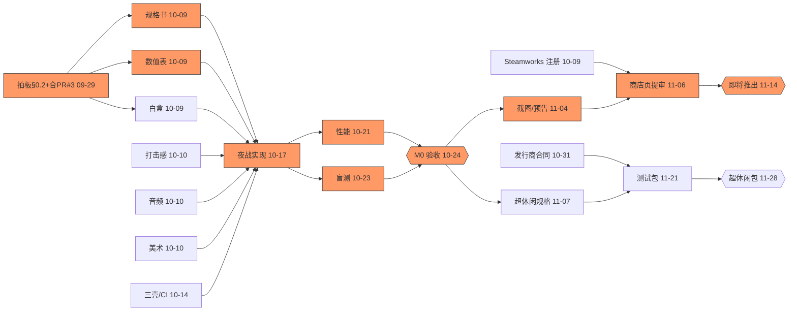

# M0 / M1 排期与依赖图（制作统筹 · 2026-09-26 草案）

> 依据：PR #21 `docs/DESIGN_BIBLE_v1.md` §5.1 / §7 / §8 / §11。日期均为 Asia/Shanghai。拍板人：laiou suo。

## 结论
- **M0 10-17：不建议照原日期。建议改为 2026-10-24（周六）验收会**，10-17 保留为"内部可玩版冻结"。理由：①剩 3 周里含国庆长假；②M0 的代码底座 PR #3 还没合并，main 仍是旧版微信小游戏；③§11 规格书、数值表、白盒都还没开始写，实现排在它们后面；④§8 #4–#6 要 5 人盲测，至少要留 3 天。
- **M1 11-14：拆成两部分。** M1a Steam「即将推出」页 **11-14 可行**，前提是 Steamworks 注册 10-09 前启动、商店页 11-06 前提审（官方说审核 3–5 个工作日，建议至少提前 7 天提交）。M1b 超休闲测试包 **建议改为 11-28**：要先签发行商合同、拿到对方 SDK，还要 Apple 开发者账号，这些都不在我们手里。

## 任务表（★ = 关键路径）
| # | 任务 | 负责人 | 截止 | 验收人 |
|---|---|---|---|---|
| D1★ | 拍板 §0.2 五处改动 + 合并 PR #3 | laiou suo | 09-29 | 制作统筹 |
| D2 | PR 去留（见 decision_log.md） | laiou suo | 09-30 | 制作统筹 |
| S1★ | M0 夜战规格书 `docs/specs/M0_NIGHT_BATTLE.md` | 游戏策划 | 10-09 | 主程/技术制作 |
| S2★ | M0 数值表 + 手感常量表 | 数值经济（打击特效共订） | 10-09 | 游戏策划 |
| S3 | 北桥白盒 + 3 分钟刷怪时间轴 | 关卡/任务设计 | 10-09 | 游戏策划 |
| S4 | 打击感规格 + 超载分镜 | 打击特效 | 10-10 | 游戏美术 |
| S5 | M0 音效规格 + 夜战音乐结构 | 游戏音频 | 10-10 | 游戏策划 |
| S6 | C1 桥头色值表 + 剪影敌人四类 | 游戏美术 / TA·像素管线 | 10-10 | 宣发主视觉 |
| B1★ | 夜战核心实现（挥砍/顿帧/数字/碎裂/连击/超载/结算，横竖屏） | 游戏搭建 + 主程（云端代理） | 10-17（冻结） | 主程/技术制作 |
| B2 | 三壳方案 + CI 性能预算 | Build/CI·平台包 | 10-14 | 主程 |
| Q1★ | 性能矩阵 p95（150 敌） | 客户端性能·内存 + 游戏测试 | 10-21 | 主程 |
| Q2★ | 5 人盲测 + 无头模拟守住率 | 游戏测试 | 10-23 | 游戏策划 |
| M0★ | **M0 验收会**（M0_acceptance_checklist.md） | 制作统筹 | **10-24** | laiou suo |
| C1 | Steamworks 注册、付 $100、税务/银行 | laiou suo | 10-09 | 制作统筹 |
| C2★ | 实机截图 ≥5 张 + 预告片 + 胶囊图全套 | 宣发主视觉 + 游戏美工 | 11-04 | 游戏美术 |
| C3★ | 商店页文案按 v1 回改 + AI 披露填报 + 提审 | meme尤里·叙事增长 + 制作统筹 | 11-06 | laiou suo |
| M1a★ | **Steam「即将推出」上线** | Build/CI | **11-14** | laiou suo |
| P1 | 发行商选定、合同签署（IP 归我方） | laiou suo（增长情报出简报） | 10-31 | 制作统筹 |
| P2 | 超休闲规格 + 经济曲线 + 5 个关卡 | 游戏策划 / 数值经济 / 关卡 | 11-07 | 游戏策划 |
| P3 | Capacitor 包、激励视频 SDK、TestFlight | Build/CI + Tools·DNA编译器 | 11-21 | 游戏测试 |
| P4 | 5 条 CPI 创意 | meme尤里 + 宣发 | 11-21 | 宣发主视觉 |
| M1b | **超休闲测试包冒烟通过** | 游戏测试 | **11-28** | laiou suo |

## 依赖图

**关键路径**：D1（拍板 + 合并 PR #3）→ 规格书/数值表 → 夜战实现 → 性能 + 盲测 → M0 验收 → 实机截图/预告片 → 商店页提审 → Steam「即将推出」。
